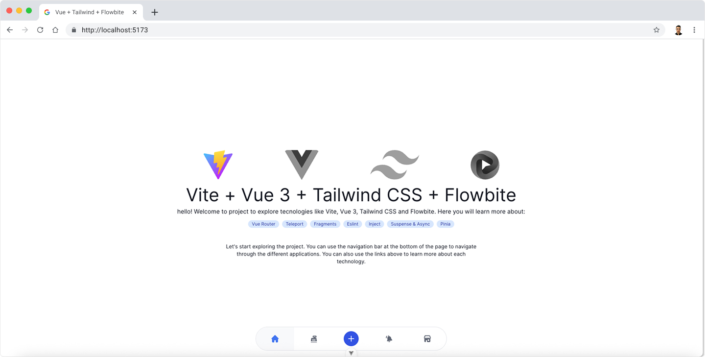

# vue-project

Welcome to project to explore tecnologies like [Vite](https://vite.dev/), [Vue 3](https://vuejs.org/), [Tailwind CSS](https://tailwindcss.com/) and [Flowbite](https://flowbite.com/). You can explore the following concepts <strong>Vue Router</strong>, <strong>Pinia</strong>, <strong>Vue Composition API</strong>, <strong>Vue Teleport</strong>, <strong>Vue Fragments</strong>, <strong>Vue Suspense</strong>, <strong>Vue Eslint</strong>, <strong>Vue Inject</strong>, and <strong>Vue Suspense & Async</strong>.



Inside the project you can find four pages controlled by [Vue Router](https://router.vuejs.org/):

## /home
This is the home page of the project. It contains a simple page with diverse components and elements with Tailwind CSS and Flowbite.
## /counter
This page contains a simple counter component that uses ref, computed and watch to manage the state of the counter

## /teleport
This page contains two modals: One that uses Vue Teleport to render the modal in a different part of the DOM, and another that uses Flowbite's modal component.


## /store
This page is similar to the counter page, but it uses Pinia to manage the state of the counter and persist the state.


# Run and Build

To run the project, you need to have Node.js installed. You can check if you have it installed by running:

```bash
node -v
```
If you don't have Node.js installed, you can download it from [nodejs.org](https://nodejs.org/).
Once you have Node.js installed, you can clone the repository and install the dependencies:

```bash
git clone git@github.com:glauco-kipu/vue-project.git
cd vue-project
npm install
```

Then, you can run the project using the following command:

```bash
npm run dev
```
This will start a development server and open the project in your default web browser. You can also access the project at `http://localhost:5173/`.

## Linting
To lint the project, you can run the following command:

```bash
npm run lint
```
This will run ESLint on the project and check for any linting errors.

## Building
To build the project for production, you can run the following command:

```bash
npm run build
```
This will create a `dist` folder with the production build of the project. You can then deploy this folder to your web server.
